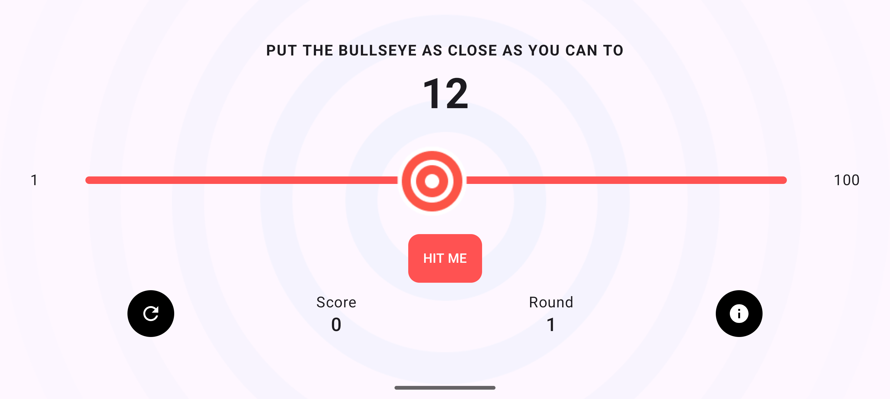
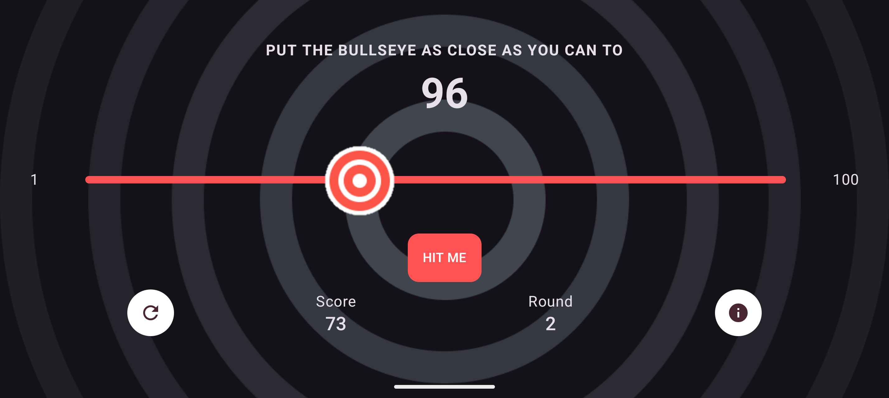
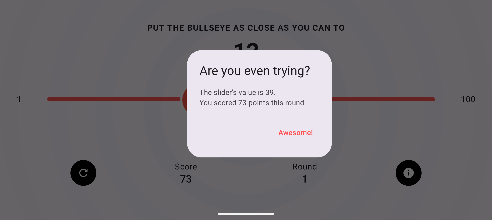
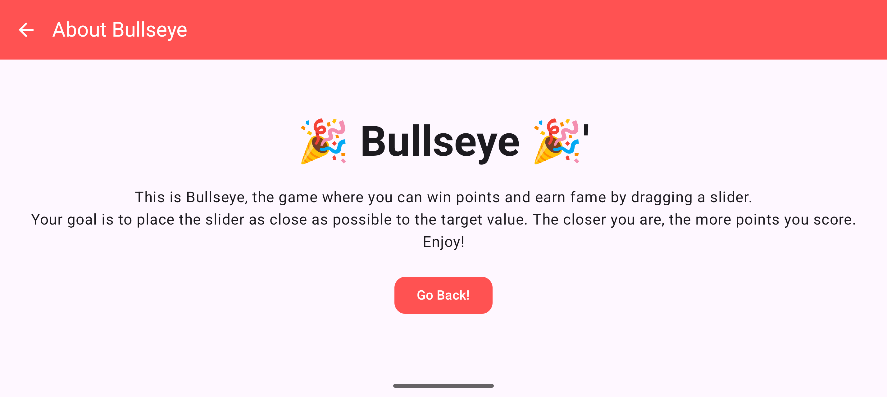

# 🎯 Bullseye Game

Bullseye is a simple and fun game built with **Kotlin** and **Jetpack Compose**.  
The goal of the game is to try to hit the target as close as possible to the bullseye. The closer you get, the higher your score!

## 🚀 Features
- Clean and modern UI using **Jetpack Compose**
- Interactive slider to choose your target position
- Real-time score calculation
- Simple game logic written in **Kotlin**
- Lightweight and easy to run

## 🛠️ Tech Stack
- **Kotlin** – for application logic
- **Jetpack Compose** – for building declarative UI

## 📱 Screenshots
 

 

## ⚡ Getting Started
Clone the repository and open it in **Android Studio**
